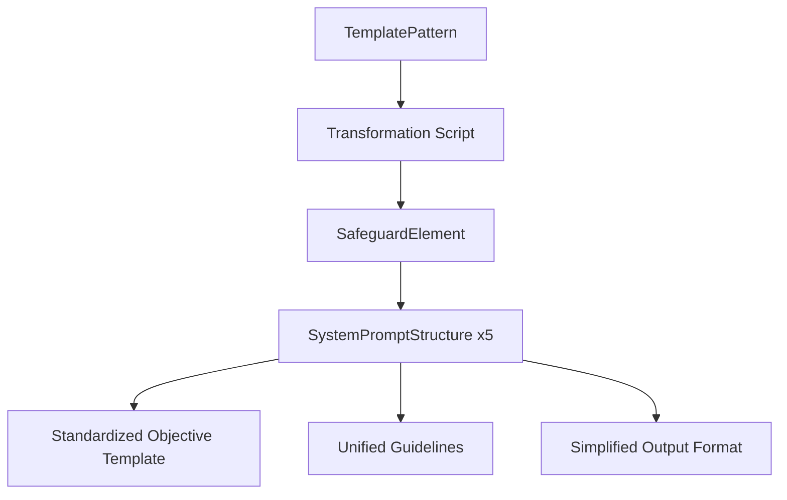

# Data Model: Standardize Prompt Structure

**Feature**: 002-standardize-prompt-structure
**Date**: 2025-12-10

## Core Entities

### SafeguardElement (Existing - Updated)

**Description**: Represents a single CIS safeguard with standardized prompt structure

**Fields**:
- `id`: string - CIS safeguard identifier (e.g., "10.2")
- `title`: string - Official CIS safeguard title
- `description`: string - Official CIS description
- `implementationGroup`: "IG1" | "IG2" | "IG3" - CIS implementation group classification
- `assetType`: string[] - Asset types this safeguard applies to
- `securityFunction`: string[] - Security functions addressed
- `governanceElements`: string[] - Critical governance requirements (Orange - MUST be met)
- `coreRequirements`: string[] - Core functional requirements (Green - The "what") - **PRESERVED unchanged**
- `subTaxonomicalElements`: string[] - Sub-taxonomical breakdown elements (Yellow)
- `implementationSuggestions`: string[] - **UPDATED** High-level implementation guidance (Gray - simplified)
- `relatedSafeguards`: string[] - Related CIS safeguard IDs
- `systemPromptFull`: SystemPromptStructure - **UPDATED** Standardized FULL capability prompt
- `systemPromptPartial`: SystemPromptStructure - **UPDATED** Standardized PARTIAL capability prompt
- `systemPromptFacilitates`: SystemPromptStructure - **UPDATED** Standardized FACILITATES capability prompt
- `systemPromptGovernance`: SystemPromptStructure - **UPDATED** Standardized GOVERNANCE capability prompt
- `systemPromptValidates`: SystemPromptStructure - **UPDATED** Standardized VALIDATES capability prompt

**Key Changes from Current**:
- All five system prompts updated with standardized objective templates
- `implementationSuggestions` simplified to 1-3 high-level items
- `coreRequirements` preserved unchanged (manual updates only)

### SystemPromptStructure (Existing - Updated)

**Description**: Standardized structure for capability-specific assessment prompts

**Fields**:
- `role`: string - Expert role identifier (preserved from original)
- `context`: string - Evaluation context (preserved from original)
- `objective`: string - **UPDATED** Standardized capability-specific assessment objective
- `guidelines`: string[] - **UPDATED** Standardized to ["Future Use"]
- `outputFormat`: string - **UPDATED** Standardized to "Provide a structured assessment, confidence score, and evidence summary"

**Objective Templates by Capability**:

**FULL**: "The vendor has taken an assessment and has been mapped to FULL by the mapping tool. Being mapped to FULL means that the vendor addresses each of the subtaxonomical elements in some way. Assess whether their answer CLEARLY educates the end user about how the vendors' tool or service helps meet the safeguard FULLY."

**PARTIAL**: "The vendor has taken an assessment and has been mapped to PARTIAL by the mapping tool. Being mapped to PARTIAL means that the vendor addresses some but not all of the subtaxonomical elements in some way. Assess whether their answer CLEARLY educates the end user about how the vendors' tool or service helps meet the safeguard PARTIALLY."

**FACILITATES**: "The vendor has taken an assessment and has been mapped to FACILITATES by the mapping tool. Being mapped to FACILITATES means that the vendors' product or service makes another tool or service, that actually implements the control, better faster, cheaper or whatever. Assess whether their answer CLEARLY educates the end user about how the vendors' tool or service FACILITATES the implementation of the safeguard."

**GOVERNANCE**: "The vendor has taken an assessment and has been mapped to GOVERNANCE by the mapping tool. Being mapped to GOVERNANCE means that the vendors' product or service provides governance, oversight, reporting, or management capabilities related to the safeguard. Assess whether their answer CLEARLY educates the end user about how the vendors' tool or service provides GOVERNANCE for the safeguard."

**VALIDATES**: "The vendor has taken an assessment and has been mapped to VALIDATES by the mapping tool. Being mapped to VALIDATES means that the vendors' product or service provides validation, auditing, compliance checking, or verification capabilities for the safeguard. Assess whether their answer CLEARLY educates the end user about how the vendors' tool or service VALIDATES compliance with the safeguard."

### TemplatePattern (New - Internal)

**Description**: Pattern extraction from safeguard 10.2 used for standardization

**Fields**:
- `sourceId`: "10.2" - Template source safeguard
- `objectiveTemplates`: Map<CapabilityType, string> - Standardized objective templates
- `standardizedGuidelines`: ["Future Use"] - Unified guidelines content
- `standardizedOutputFormat`: string - Unified output format
- `implementationSimplificationPattern`: RegExp - Pattern for simplifying implementation suggestions

**Usage**: Internal reference for transformation script to ensure consistent application across all safeguards

## Data Relationships

## Data Validation Rules

### SafeguardElement Validation
- `id` must match CIS safeguard pattern (e.g., "1.1", "10.2", "18.5")
- All five system prompts must be present and complete
- `coreRequirements` must be preserved unchanged from original
- `implementationSuggestions` must contain 1-3 items (after simplification)

### SystemPromptStructure Validation
- `objective` must match standardized template for capability type
- `guidelines` must equal exactly ["Future Use"]
- `outputFormat` must equal exactly "Provide a structured assessment, confidence score, and evidence summary"
- `role` and `context` must be preserved from original (no changes)

### Transformation Constraints
- Total safeguard count must remain 153
- All original metadata fields must be preserved unchanged
- No new capability types introduced
- Existing API contracts must remain functional

## Data Integrity

**Preservation Requirements**:
- All CIS Controls framework authenticity maintained
- Essential safeguard coverage retained
- Backward compatibility with existing API consumers
- Five-capability structure from v2.0.0 unchanged

**Quality Assurance**:
- Automated validation script confirms 100% template compliance
- Manual spot-checking of representative safeguards
- API testing to ensure unchanged response structure